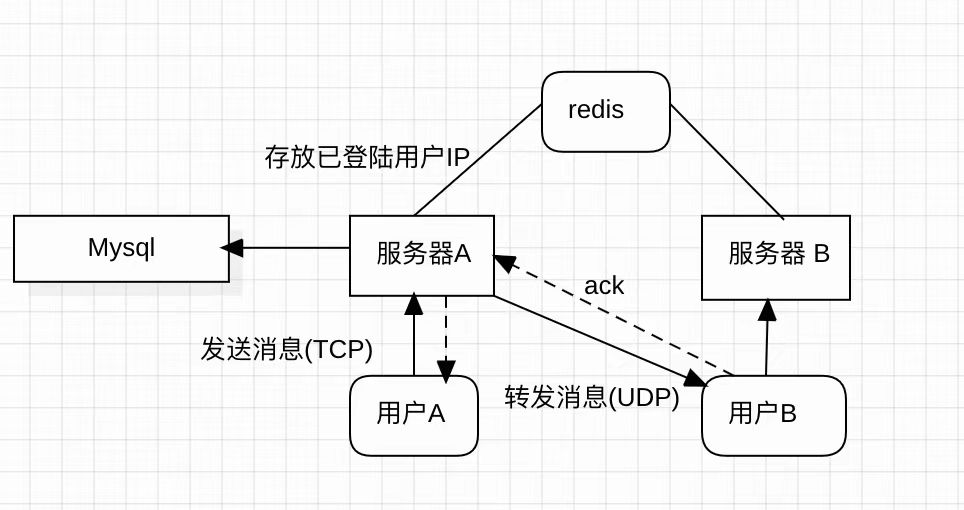

# IMsoftware
即时聊天软件服务器集群

I/O模型：Reactor事件驱动模式


## 依赖

- C++17
- hiredis库
- mysql库
- Libevent库
- Json for modern C++


## 使用

```
mkdir build
cd build
cmake ..
make
```


## 实现思路


架构设计：

第一版设计

采用TCP连接，当在不同的服务器上登陆的用户间相互发消息时，服务器将消息推送到redis消息中间件，起一个缓冲瞬时流量的作用。


优点：可以瞬时接受大量流量

缺点：消息延迟较高，收发


优化设计：

采用TCP+UDP协议，当用户A向B发消息时，服务器在接收到消息后，会判读B是否在当前的服务器上，如果不在，则去查询用户B的IP地址，然后通过udp协议直接发送（redis存放已经登陆用户的IP地址），同时在服务器中引入缓存，如果本地缓存有则无需向redis中发送请求。

 

优点：可以实现即时消息

缺点：实现应用层的可靠传输协议相对复杂

### 数据库表：

#### User表：

冷热分表，优化查询速度

| 字段名称            | 类型        | 说明         | 约束                        |
| ------------------- | ----------- | ------------ | --------------------------- |
| _id                 | BIGINT      | 用户唯一标识 | PRIMARY KEY，AUTO_INCREMENT |
| user_name           | VARCHAR(32) | 用户名       | NOT NULL                    |
| profile_picture_url | VARCHAR(32) | 头像地址     | NOT NULL                    |
| _state              | int         | 用户状态     |                             |

| 字段名称      | 类型        | 说明         | 约束                        |
| ------------- | ----------- | ------------ | --------------------------- |
| _id           | BIGINT      | 用户唯一标识 | PRIMARY KEY，AUTO_INCREMENT |
| user_password | VARCHAR(32) | 用户密码     | NOT NULL                    |
| Phone_nuber   | VARCHAR(32) | 电话号码     | NOT NULL                    |


#### Friend表：

用户好友表

| 字段名称  | 类型        | 说明         | 约束                        |
| --------- | ----------- | ------------ | --------------------------- |
| _id       | BIGINT      | 唯一标识     | PRIMARY KEY，AUTO_INCREMENT |
| _userID   | BIGINT      | 用户id       | FOREIGN KEY，INDEX          |
| _friendID | BIGINT      | 好友id       | FOREIGN KEY                 |
| _state    | int         | 好友关系状态 | NOT NULL                    |
| _Name     | varchar(30) | 备注昵称     | default null                |
| _Group    | int         | 所属分组     | FOREIGN KEY                 |

不足：

- 存在冗余存储的问题，A与B的好友关系，需要两条记录存储
- 查询某用户的所有好友时，需要读取数据页的次数较多（_userID相同的数据过于分散）


#### OfflineMsg表：

| 字段名称        | 类型    | 说明       | 约束                     |
| --------------- | ------- | ---------- | ------------------------ |
| message_id      | int     | 消息标识   | NOT NULL，AUTO_INCREMENT |
| conversation_id | BIGINT  | 会话id     | NOT NULL                 |
| fromID          | BIGINT  | 发送者id   | FOREIGN KEY              |
| toID            | BIGINT  | 接受者id   | FOREIGN KEY              |
| Message_type    | Int     | 消息类型   | NOT NULL                 |
| message_text    | text    | 消息信息   | NOT NULL                 |
| is_read         | boolean | 是否已接收 | NOT NULL                 |
| send_time       | Date    | 时间       | NOT NULL                 |

复合索引：coversation_id,send_time;方便快速查找两个用户的所有聊天记录

message_text，当问文件类型时，message_text为文件的地址薪资

### 通信协议的设计：

TCP协议是数据流协议，底层根据二进制缓冲区的实际情况进行包的划分，会出现半包、粘包问题。通过设计通信协议来处理半包、粘包问题。

包头：

| 字段名  | 字段类型 | Request            |
| :------ | :------- | :----------------- |
| magic   | int      | 是否有效           |
| code    | 整数     | 应答结果代码       |
| version | 整数     | 请求发起方程序版本 |
| len     | int      | 负载大小           |

基于UDP的可靠应用层协议：

| 字段名  | 字段类型 | Request             |
| :------ | :------- | :------------------ |
| magic   | int      | 是否有效            |
| flag    | int      | 包类型（ACK、MSG等) |
| seq     | int      | 序列号              |
| ack     | int      | 确认号              |
| version | 整数     | 请求发起方程序版本  |
| check   | int      | 校验和              |
| len     | int      | 负载大小            |

序列号与确认机制：发送方发送数据包时，将序列号递增。接收方收到数据包后，发送一个包含确认号的ACK包，确认号对应已成功接收的最后一个数据包序列号。

超时重传机制：发送方在每次发送数据包后，启动一个计时器。如果在计时器超时前没有收到ACK，发送方将重传该数据包。


#### 文档待完善......
